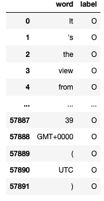

# datascience_challenge

## Overview:
This was a 2 day data science challenge that involved creating a machine learning model based off the train.txt data given, no other instructions were given. The dataset involved a list of words from a paragraph and The challenge goes through data cleaning, Exploratory Data Analysis, and touches on Natural Language Processing in order to create a usable model. As this was my first time using the NLTK package, I learned a lot about the package and basic NLP. 

## Dataset:

Labels: O, B-location, I-location, B-group, B-corporation,
        B-person, B-creative-work, B-product, I-person,
        I-creative-work, I-corporation, I-group, I-product
        
O - Doesn't belong in any chunk

B - Beginning of Chunk

I - Inside of Chunk
 

## Programs used:
* Python
* Pandas
* Seaborn
* NLTK
* Scikit-Learn

## Quick Findings:
### Accuracies
* Logistic Regression - 0.9538
* Random Forest - 0.9536
* Multinomial Naive Bayes - 0.9474

###
